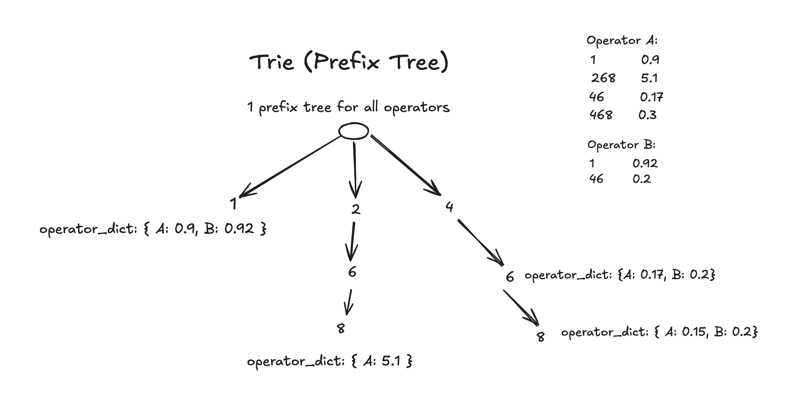

# telephone-routing
Telephone Routing is a Python project that helps find the cheapest operator for a given telephone number based on prefix matching.

## Features

- Python version: 3.11
- Efficient prefix searching using a Trie data structure
- Fast lookup of the cheapest operator for any given phone number (O(n) search time complexity)
- Unit tests to ensure reliability and correctness

## Project Structure

```
telephone-routing/
├── src/
│   └── telephone_routing/
│       ├── model/
│       ├── repository/
│       └── service/
├── tests/
├── README.md
└── requirements.txt
```

## Installation

1. Clone the repository:

```bash
$ git clone https://github.com/yourusername/telephone-routing.git
$ cd telephone-routing
```

2. Set up a virtual environment (recommended):

```bash
$ python -m venv .venv
$ source .venv/bin/activate
```

3. Install the required dependencies:

```bash
$ pip install -r requirements.txt
```

4. Run the program

```bash
$ python src/telephone_routing/main.py
```

## Testing

1. Run test using pytest command

```bash
$ pytest -s
```

2. Run coverage report

```bash
$ coverage run -m pytest -s
$ coverage report
```

## Approach

### General approach

Find the *price* of *input_number* for each operator, then save and update the values of min_price and cheapest_operator while checking in a for loop

#### Data structure

Store all operators in a ***Dict*** (or a list of operator), with key is operator name and the value is a dict of prefix and the corresponding price

Example:
```
{
    "operator_a": {
        "1": 0.9, 
        "268": 0.5,
        ...
    },
    "operator_b": {
        "1": 0.92, 
        "467": 1.0,
        ...
    }
}
```

#### Complexity

**Search time complexity**: O(m * n)
- m: number of all operators
- n: length of the input_number string

**Build Data Structure Complexity**: O(m * l)
- m: number of all operators
- l: average number of prefixs in all operators

**Space Complexity**: O(m * l)
- m: number of all operators
- l: average number of prefixs in all operators

---

### Search time improvement approach

Step of this approach:
- Load all the operator from files to a list of Operator objects
- Sort the dict {prefix: price} in each operator. Ex: `{"467": 0.9, "46": 1.1}` --> `{"46": 1.1, "467": 0.9}`
- Insert all elements {prefix, price} of each operator to a Trie one after another
- Searching prefix of the input number throughout trie

#### Data structure

Build a Trie (prefix tree) to store all `{prefix: price}` elements of all operators. Each node store the a dict with format `{operator: price}`. If a dict value of the node is updated, update this value to **all children of this node**.



#### Complexity

**Search time complexity**: O(n) + O(m)
- m: number of all operators
- n: length of the input_number string

**Build Data Structure Time Complexity**: O(m * l * log(l)) + O(m * l * k)
- m: number of all operators
- n: length of the input_number string
- l: the average number of prefixs in all operators
- k: number of nodes in Trie

**Space Complexity**: O(m * k)
- k: number of nodes in Trie
- m: number of all operators